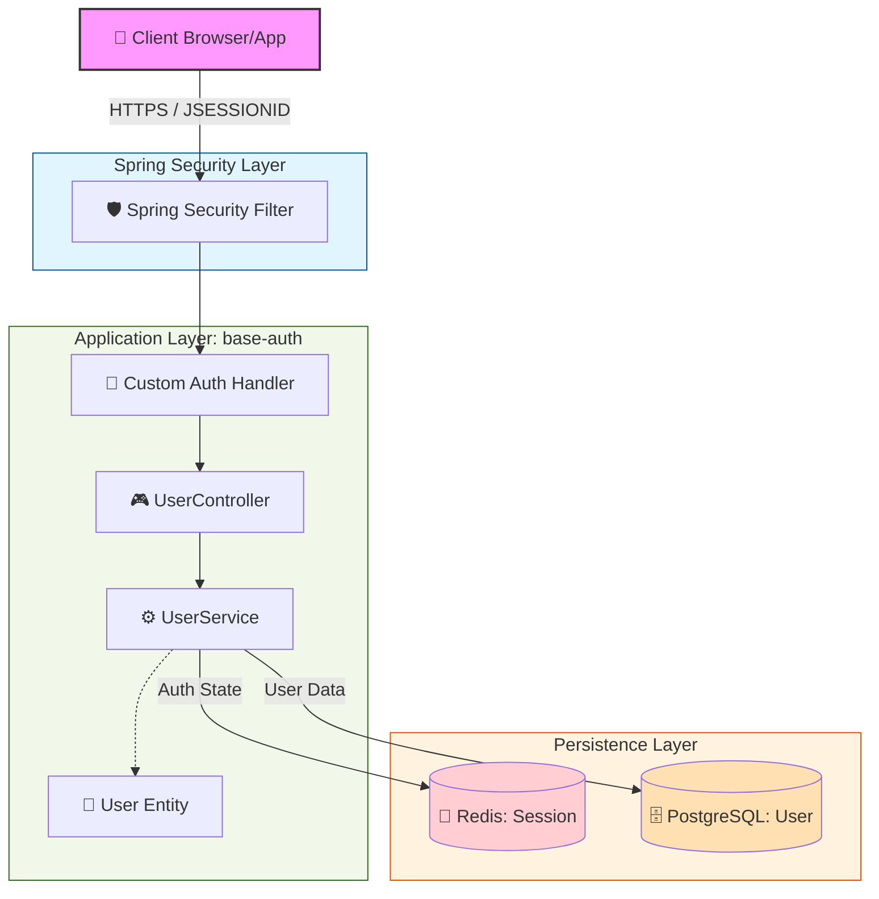

## 왜 로그인 서비스인가?

인증은 모든 서비스에서 공통적으로 사용되면서도 트래픽과 보안이 동시에 중요한 영역이라고 생각해서 
인증 서비스를 직접 설계하는 프로젝트를 진행했습니다.

---

### 🏗️ 시스템 아키텍처 다이어그램 (Current)



### 🔍 주요 흐름 및 구성 요소 설명

이 설계는 **Spring Security**를 기반으로 한 사용자 인증 및 데이터 관리 구조입니다.

1.  **Client (브라우저/앱)**
    *   사용자가 HTTPS 프로토콜을 통해 접속합니다.
    *   인증된 사용자는 `JSESSIONID`를 쿠키에 담아 서버와 통신합니다.

2.  **Spring Security Filter**
    *   모든 요청의 관문입니다. 설정된 보안 규칙에 따라 요청을 필터링하고, 인증되지 않은 접근을 차단합니다.

3.  **Application Layer (base-auth)**
    *   **Custom Auth Handler:** 로그인이 성공하거나 실패했을 때, 혹은 권한이 없을 때의 커스텀 로직을 처리합니다.
    *   **UserController:** 클라이언트의 요청(REST API)을 받는 엔드포인트입니다.
    *   **UserService:** 핵심 비즈니스 로직이 수행되는 곳입니다. 세션 상태 확인이나 DB 조회를 지시합니다.
    *   **User Entity:** 데이터베이스의 테이블과 매핑되는 객체 모델입니다.

4.  **Persistence Layer (저장소)**
    *   **Redis (Session Store):** 로그인한 사용자의 세션 정보(Auth State)를 메모리에 저장합니다. 속도가 매우 빠르며, 여러 서버 간 세션 공유가 가능합니다.
    *   **PostgreSQL (User Store):** 사용자의 프로필, 비밀번호, 가입일 등 영구적인 데이터를 저장하는 관계형 데이터베이스입니다.
---

**특징:**
*   **보안성:** Spring Security를 최전방에 두어 보안 계층을 분리했습니다.
*   **성능:** 세션 정보를 DB가 아닌 Redis에 저장함으로써 데이터베이스 부하를 줄이고 응답 속도를 높였습니다.
*   **구조화:** 계층형 아키텍처(Layered Architecture)를 따라 유지보수가 용이하게 설계되었습니다.

## 📝 Technical Decision Record (TDR)

### [Decision 1] Redis 기반 분산 세션(Session) 방식 채택 이유

* **Context**: 과거 제한된 서버 자원 환경에서 운영 중, 동시 접속자가 증가함에 따라 DB 커넥션 풀(Connection Pool) 고갈로 인해 전체 서비스가 응답 불능 상태에 빠지는 장애를 경험했습니다.
* **Analysis**: 분석 결과, 매 요청마다 발생하는 세션 검증(Session Look-up)이 비즈니스 쿼리와 동일한 DB 커넥션을 공유하면서 발생한 병목이었습니다.
* **Rationale**:
자원 효율화: 빈번한 인증 확인 로직을 메모리 기반의 Redis로 이관하여, PostgreSQL의 커넥션 자원을 핵심 비즈니스 로직(CRUD) 처리에 집중시켰습니다.
독립성 확보: 인증 저장소를 분리함으로써, 설령 비즈니스 DB에 과부하가 걸리더라도 최소한의 인증 서비스는 정상 동작할 수 있는 구조를 지향했습니다.
확장성(Scale-out): 세션 정보를 중앙화하여 향후 여러 대의 서버로 확장하거나 타 서비스와 세션을 공유할 때에도 추가적인 구조 변경 없이 대응 가능합니다.

### [Decision 2] Argon2 해시 알고리즘 채택 이유
*   **Context**: 기존 BCrypt는 오랜 기간 검증된 알고리즘이지만, 패스워드를 72바이트로 제한하는 구조적 한계와 GPU 기반 병렬 공격에 대한 상대적 취약성이 존재합니다.
*   **Rationale**: Argon2는 메모리 하드(Memory-hard) 방식으로 설계되어, 대규모 하드웨어를 동원한 공격에 대해 BCrypt보다 훨씬 높은 저항성을 가짐. 장기적인 보안 지속 가능성을 위해 최신 표준인 Argon2를 선택헸습니다.
      다만 개인 프로젝트 규모에서는 리소스 부담이 있는 선택임을  인지하고 있으며, 실무에서는 서버 환경과 트래픽을 고려한 튜닝이 필요하다 생각합니다.

## 트러블슈팅
미인증 접근 시 HTML 리다이렉트 반환 문제
- **문제**:
보호된 자원에 인증 없이 접근 시 Spring Security 기본 동작인 HTML 리다이렉트가 반환됩니다.
REST API 환경에서는 클라이언트가 JSON 형태의 명확한 에러 응답을 기대하기 때문에 에러응답을 필요합니다.
- **원인**:
Spring Security 는 기본적으로 미인증 요청을 로그인 페이지로 리다이렉트합니다.
API 서버에서는 이 동작을 명시적으로 재정의해야 한다.
- **해결**:
AuthenticationEntryPoint 를 커스텀 구현하여 401 응답과 JSON 메시지를 반환하도록 처리
```bash
$ curl -i http://localhost:8080/api/v1/users/me

HTTP/1.1 401 Unauthorized
{"message":"인증이 필요합니다."}
```

---

## 🚀 Project Roadmap

각 단계의 상세 설계(TDR) 및 구현 기록은 해당 링크에서 확인할 수 있습니다.

- [x] **[Phase 1: 초기 구축 및 기본 보안 적용](docs/phase/PHASE1_ANALYSIS.md)** (Completed ✅)
    - Spring Security 기반 세션 인증 구현
    - Argon2 기반 비밀번호 해시 적용
    - PostgreSQL 기반 사용자 정보 관리
    - 세션 기반 인증 흐름 구성 (로그인 / 인증 / 권한 검증)

- [ ] **[Phase 2: JWT 기반 인증 전환](docs/phase/PHASE2_JOURNAL.md)** (In Progress 🏗️)
    - 세션 방식에서 JWT 기반 Stateless 인증으로 전환
    - Access Token / Refresh Token 구조 도입
    - Redis 기반 Refresh Token 관리
    - 인증 검증에서 DB I/O 제거 (서명 기반 검증)

- [ ] **Phase 3: 안정성 및 트래픽 대응 강화** (Planned 📅)
    - 로그인 동시 요청 증가 시 병목 지점 대응
    - 로그인 실패 횟수 제한 및 Rate Limiting 적용
    - 토큰 재발급 동시 요청 시 Race Condition 방지

- [ ] **Phase 4: 기능 확장**
    - 소셜 로그인 (OAuth2) 추가
    - 사용자 권한(Role) 기반 접근 제어 확장

- [ ] **Phase 5: Reliability & Visibility**
    - 인증 로그 수집 및 추적 구조 도입
    - 모니터링 및 장애 대응 체계 구축
    - 인증 요청 흐름 가시성 개선

---

