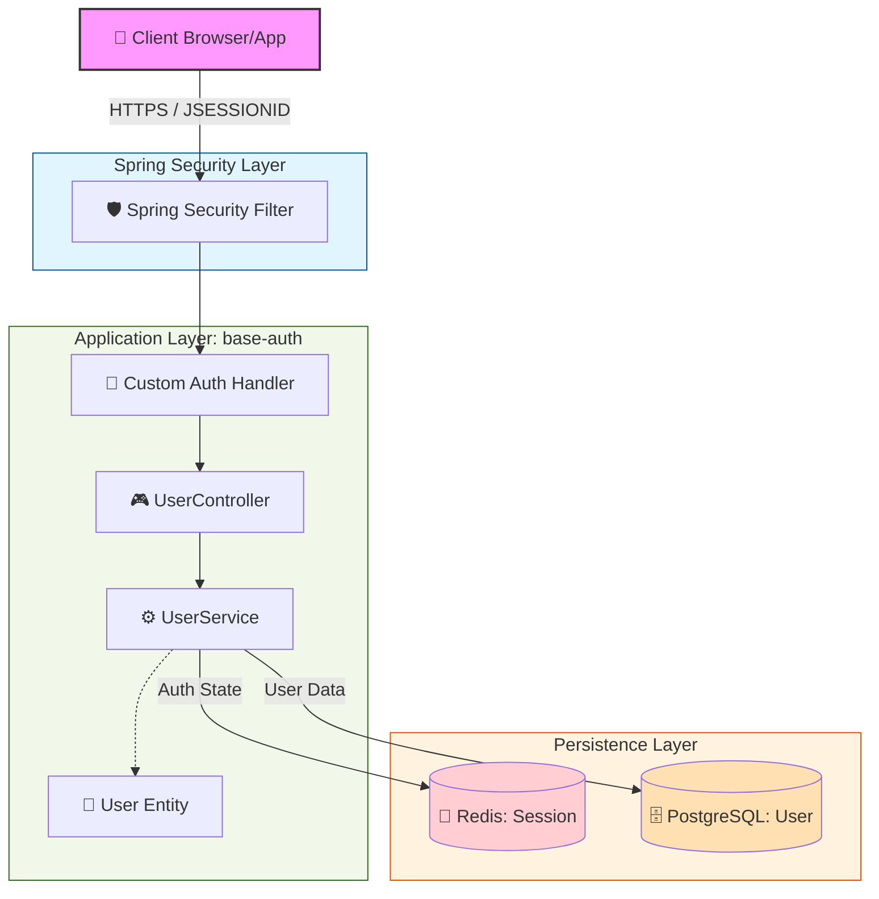

### ✅ Phase1 시스템 아키텍처 다이어그램 

---

### 🔍 주요 흐름 및 구성 요소 설명

이 설계는 **Spring Security**를 기반으로 한 사용자 인증 및 데이터 관리 구조입니다.

1.  **Client (브라우저/앱)**
    *   사용자가 HTTPS 프로토콜을 통해 접속합니다.
    *   인증된 사용자는 `JSESSIONID`를 쿠키에 담아 서버와 통신합니다.

2.  **Spring Security Filter**
    *   모든 요청의 관문입니다. 설정된 보안 규칙에 따라 요청을 필터링하고, 인증되지 않은 접근을 차단합니다.

3.  **Application Layer (base-auth)**
    *   **Custom Auth Handler:** 로그인이 성공하거나 실패했을 때, 혹은 권한이 없을 때의 커스텀 로직을 처리합니다.
    *   **UserController:** 클라이언트의 요청(REST API)을 받는 엔드포인트입니다.
    *   **UserService:** 핵심 비즈니스 로직이 수행되는 곳입니다. 세션 상태 확인이나 DB 조회를 지시합니다.
    *   **User Entity:** 데이터베이스의 테이블과 매핑되는 객체 모델입니다.

4.  **Persistence Layer (저장소)**
    *   **Redis (Session Store):** 로그인한 사용자의 세션 정보(Auth State)를 메모리에 저장합니다. 속도가 매우 빠르며, 여러 서버 간 세션 공유가 가능합니다.
    *   **PostgreSQL (User Store):** 사용자의 프로필, 비밀번호, 가입일 등 영구적인 데이터를 저장하는 관계형 데이터베이스입니다.
---

**특징:**
*   **보안성:** Spring Security를 최전방에 두어 보안 계층을 분리했습니다.
*   **성능:** 세션 정보를 DB가 아닌 Redis에 저장함으로써 데이터베이스 부하를 줄이고 응답 속도를 높였습니다.
*   **구조화:** 계층형 아키텍처(Layered Architecture)를 따라 유지보수가 용이하게 설계되었습니다.