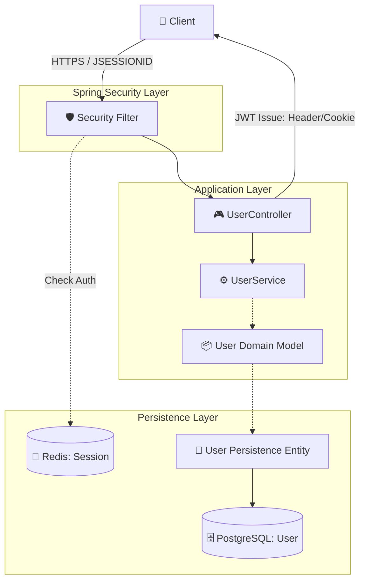
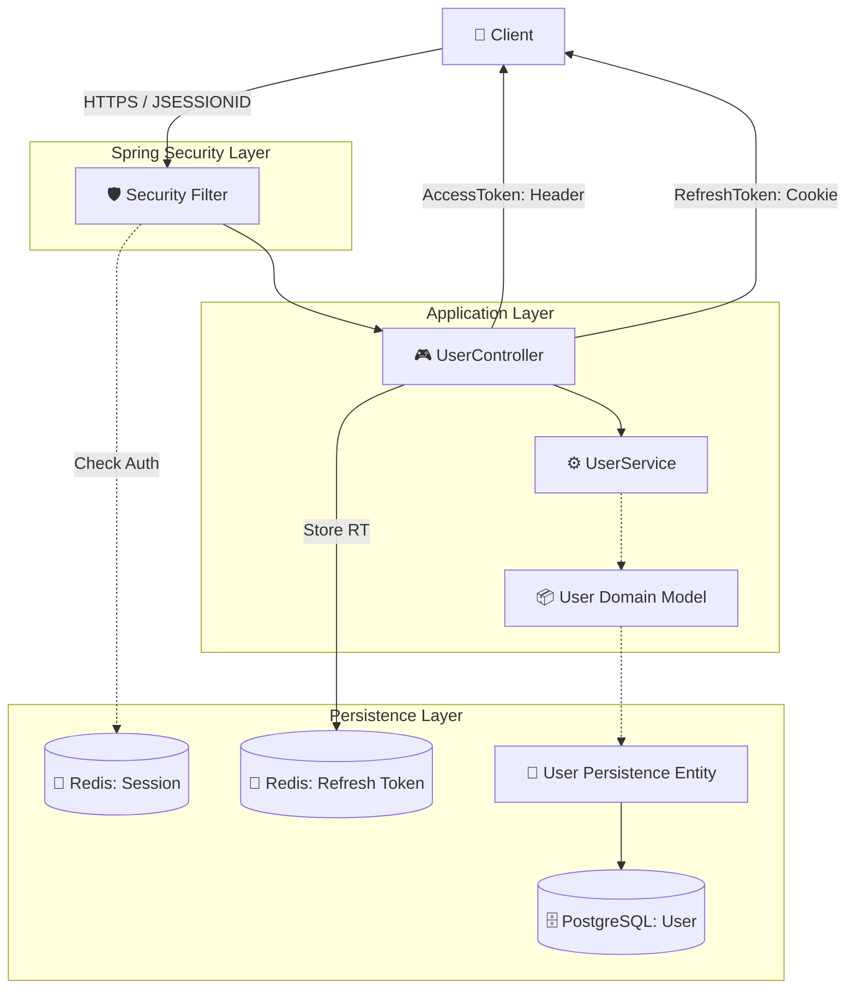
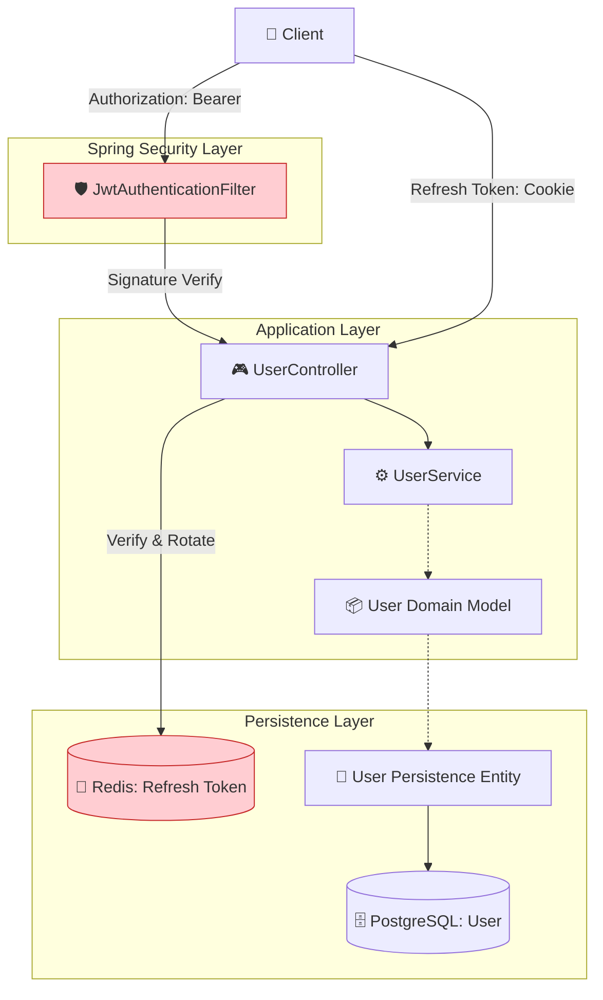

# Phase 2 아키텍처 변화 (Step-by-Step)

## 1. Phase 2-1: JWT 발급 및 하이브리드 인증
기존 세션 방식을 유지하면서, 로그인 시 JWT(Access/Refresh) 토큰을 함께 발급하는 단계입니다.

---

## 2. Phase 2-2: Redis Refresh Token 관리 (RTR 도입)
Refresh Token의 상태를 Redis에서 관리하여 보안성과 제어권을 확보한 단계입니다.

---

## 3. Phase 2-3: Stateless JWT 인증 완성 (Target)
서버의 세션(HttpSession)을 완전히 제거하고, 모든 인증을 JWT 서명 검증만으로 처리하는 최종 단계입니다.

---

### 🔍 주요 변화 요약

1.  **Phase 2-1 (Hybrid)**: 세션 기반 인증은 유지하되, 클라이언트에 토큰을 전달하기 시작함.
2.  **Phase 2-2 (RTR)**: Redis에 Refresh Token을 저장하여 서버 측에서 세션 강제 종료 및 탈취 감지 기능을 확보함.
3.  **Phase 2-3 (Stateless)**: 서버의 세션 저장소(`JSESSIONID`)를 제거하고, 매 요청마다 JWT를 검증하여 서버의 상태를 없앰(Stateless).
