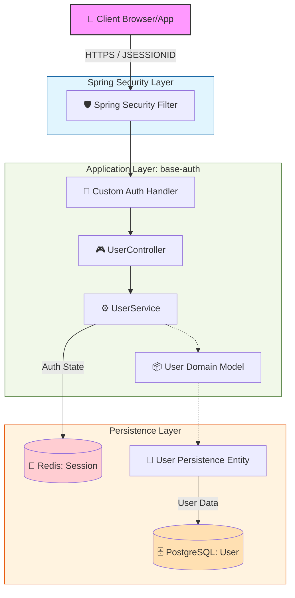

### 🏗️ Phase2 시스템 아키텍처 다이어그램 (Current)

```mermaid
graph TD
    %% 노드 정의
    Client[📱 Client Browser/App]
    
    subgraph Security_Layer [Spring Security Layer]
        Security[🛡️ Spring Security Filter]
    end

    subgraph App_Layer [Application Layer: base-auth]
        AuthHandler[🔑 Custom Auth Handler]
        Controller[🎮 UserController]
        Service[⚙️ UserService]
        Domain[📦 User Domain Model]
    end

    subgraph Persistence_Layer [Persistence Layer]
        Redis[(🧠 Redis: Session )]
        Entity[📄 User Persistence Entity]
        DB[(🗄️ PostgreSQL: User )]
    end

    %% 연결 관계
    Client -->|HTTPS / JSESSIONID| Security
    Security --> AuthHandler
    AuthHandler --> Controller
    Controller --> Service
    Service -.-> Domain
    Domain -.-> Entity
    
    Service -->|Auth State| Redis
    Entity -->|User Data| DB

    %% 스타일 설정
    style Client fill:#f9f,stroke:#333,stroke-width:2px
    style Security_Layer fill:#e1f5fe,stroke:#01579b
    style App_Layer fill:#f1f8e9,stroke:#33691e
    style Persistence_Layer fill:#fff3e0,stroke:#e65100
    style Redis fill:#ffcdd2
    style DB fill:#ffe0b2
```